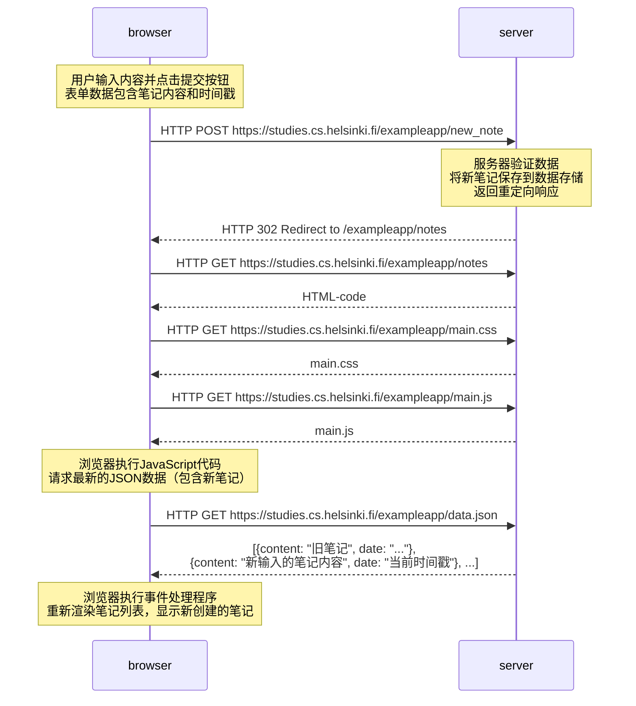

```mermaid
sequenceDiagram
    participant browser
    participant server
    
    Note over browser: 用户输入内容并点击提交按钮<br/>表单数据包含笔记内容和时间戳
    browser->>server: HTTP POST https://studies.cs.helsinki.fi/exampleapp/new_note
    Note over server: 服务器验证数据<br/>将新笔记保存到数据存储<br/>返回重定向响应
    server-->>browser: HTTP 302 Redirect to /exampleapp/notes
    
    browser->>server: HTTP GET https://studies.cs.helsinki.fi/exampleapp/notes
    server-->>browser: HTML-code
    browser->>server: HTTP GET https://studies.cs.helsinki.fi/exampleapp/main.css
    server-->>browser: main.css
    browser->>server: HTTP GET https://studies.cs.helsinki.fi/exampleapp/main.js
    server-->>browser: main.js
    
    Note over browser: 浏览器执行JavaScript代码<br/>请求最新的JSON数据（包含新笔记）
    browser->>server: HTTP GET https://studies.cs.helsinki.fi/exampleapp/data.json
    server-->>browser: [{content: "旧笔记", date: "..."}, <br/>{content: "新输入的笔记内容", date: "当前时间戳"}, ...]
    
    Note over browser: 浏览器执行事件处理程序<br/>重新渲染笔记列表，显示新创建的笔记
```