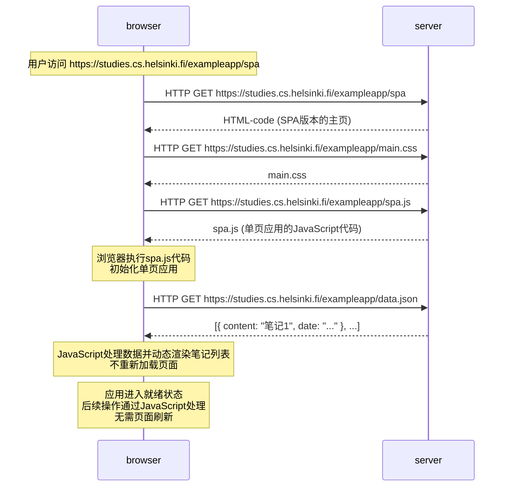

```mermaid
sequenceDiagram
    participant browser
    participant server

    Note over browser: 用户访问 https://studies.cs.helsinki.fi/exampleapp/spa
    
    browser->>server: HTTP GET https://studies.cs.helsinki.fi/exampleapp/spa
    server-->>browser: HTML-code (SPA版本的主页)
    
    browser->>server: HTTP GET https://studies.cs.helsinki.fi/exampleapp/main.css
    server-->>browser: main.css
    
    browser->>server: HTTP GET https://studies.cs.helsinki.fi/exampleapp/spa.js
    server-->>browser: spa.js (单页应用的JavaScript代码)
    
    Note over browser: 浏览器执行spa.js代码<br/>初始化单页应用
    
    browser->>server: HTTP GET https://studies.cs.helsinki.fi/exampleapp/data.json
    server-->>browser: [{ content: "笔记1", date: "..." }, ...]
    
    Note over browser: JavaScript处理数据并动态渲染笔记列表<br/>不重新加载页面
    
    Note over browser: 应用进入就绪状态<br/>后续操作通过JavaScript处理<br/>无需页面刷新
```