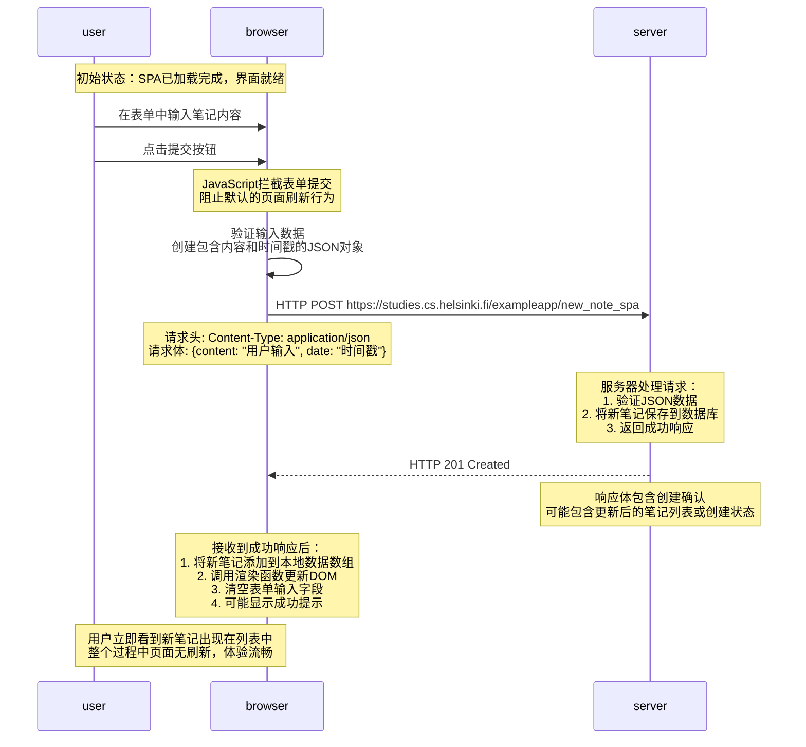

```mermaid
sequenceDiagram
    participant user
    participant browser
    participant server

    Note over user, browser: 初始状态：SPA已加载完成，界面就绪
    
    user->>browser: 在表单中输入笔记内容
    user->>browser: 点击提交按钮
    
    Note over browser: JavaScript拦截表单提交<br/>阻止默认的页面刷新行为
    
    browser->>browser: 验证输入数据<br/>创建包含内容和时间戳的JSON对象
    
    browser->>server: HTTP POST https://studies.cs.helsinki.fi/exampleapp/new_note_spa
    Note over browser: 请求头: Content-Type: application/json<br/>请求体: {content: "用户输入", date: "时间戳"}
    
    Note over server: 服务器处理请求：<br/>1. 验证JSON数据<br/>2. 将新笔记保存到数据库<br/>3. 返回成功响应
    
    server-->>browser: HTTP 201 Created
    Note over server: 响应体包含创建确认<br/>可能包含更新后的笔记列表或创建状态
    
    Note over browser: 接收到成功响应后：<br/>1. 将新笔记添加到本地数据数组<br/>2. 调用渲染函数更新DOM<br/>3. 清空表单输入字段<br/>4. 可能显示成功提示
    
    Note over user, browser: 用户立即看到新笔记出现在列表中<br/>整个过程中页面无刷新，体验流畅
```